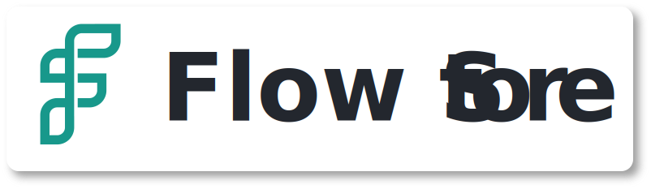

<p align="center">
  
</p>

# Bem vindo ao aplicativo Flow Store - Por Rodrigo Vieira 🚀

Este é um sistema de gerenciamento de produtos e fabricantes, contendo operações CRUD, filtro de busca e integrações com APIs externas para autopreenchimento de formulários.

## Índice 📝

- [1. Primeiros passos](#primeiros-passos)
- [2. Conhecendo o projeto](#conhecendo-o-projeto)
  - [2.1. Estrutura de pastas](#estrutura-de-pastas)
- [3. Desenvolvimento e testes](#desenvolvimento-e-testes)
- [4. Conclusão](#conclusão)
- [5. Referências](#referências)

## Primeiros passos

Para iniciar o projeto, é importante que seu ambiente de desenvolvimento esteja
devidamente configurado, contendo o git e o npm instalados, realizado a configuração de
ssh no git e github. Caso precise configurar, acesse a [documentação de configuração
de ambiente](docs/configuracaoDeAmbiente.md).

Após configurar o ambiente, vamos realizar o download do projeto. Abra o terminal
vá até o diretório desejado, realize o clone via SSH e vá até a pasta principal
da seguinte forma:

```sh
git clone git@github.com:RodrigoVieira06/volttaTest-FlowStore.git
cd volttaTest-FlowStore/
```

Agora, é necessário instalar as dependências contidas no package.json:

```sh
npm install
```

Com o repositorio em mãos, deveremos adicionar as variáveis de ambiente utilizando o comando:

```sh
ng generate environments
```

Vá até o repositório ``/environments`` localizado na pasta ``/src`` e adicione a seguintes variáveis:

```js
{
  BASE_URL: "{{URL_DA_API}}",
  VIACEP_URL: "{{URL_DO_VIACEP}}",

  MANUFACTURERS_ENDPOINT: "{{ENDPOINT_FABRICANTES}}",
  MANUFACTURERS_ENDPOINT_BY_NAME: "{{ENDPOINT_FABRICANTES_POR_NOME}}",

  PRODUCTS_ENDPOINT: "{{ENDPOINT_PRODUTOS}}"
};
```

Cada string deve estar de acordo com a url base da API servida pelo backend da aplicação. Por motivos de segurança, essas informações podem ser obtidas com a equipe de desenvolvimento ou através da documentação do Swagger.

```sh
ng serve
```

A aplicação estará disponível em ``http://localhost:4200``.

## Conhecendo o projeto

Esta aplicação foi desenvolvida com Angular 18.1.2, estilizações com SCSS e uso de padrões com a lib RxJS para as requisições e atualização de dados. Para os componentes sidenav, dialog e autocomplete input foi utilizada a biblioteca de estilos Angular Material. O projeto conta também com testes de unidade utilizando Karma e Jasmine, garantindo que as funcionalidades estejam funcionando sempre que um novo commit for realizado.

<div align="center">
  
  
  
  
  
</div>

### Estrutura de pastas

Abaixo, está o modelo da estrutura dos diretórios do projeto.

```sh
/
├── docs/
├── node_modules/
├── public/
│   ├── assets/
|   |   ├── icons/
|   |   ├── images/
|   |   └── styles/
├── src/
│   ├── app/
│   │   ├── pages/
│   │   │   ├── manufacturers/
│   │   │   └── products/
│   │   ├── shared/
│   │   │   ├── components/
|   │   │   ├── models/
│   │   │   ├── services/
|   │   │   └── utils/
│   |   ├── app-routing.module.ts
│   |   ├── app.component.html
│   |   ├── app.component.scss
│   |   ├── app.component.spec.ts
│   |   ├── app.component.ts
│   |   ├── app.module.server.ts
│   |   └── app.module.ts
│   ├── environments/
│   ├── index.html
│   ├── main.server.ts
│   ├── main.ts
│   └── styles.scss
├── .editorconfig
├── .gitignore
├── angular.json
├── package-lock.json
├── package.json
├── README.md
├── server.ts
├── tsconfig.app.json
├── tsconfig.json
└── tsconfig.spec.json
```

Você pode entender detalhadamente a estrutura de diretórios utilizada acessando a
[documentação de estrutura do projeto](docs/estruturaDoProjeto.md).

## Construir e rodar o projeto com o Docker

Para este projeto, foi utilizado o Makefile, pelos seguintes motivos:

- Simplicidade: Simplifica a execução de comandos Docker longos e complexos.
- Automação: Facilita a automação de tarefas comuns de desenvolvimento e deployment.
- Manutenibilidade: Facilita a manutenção e documentação dos comandos necessários para o seu projeto.

Eles disparam comandos docker para as finalidades abaixo:

## Desenvolvimento e testes

Durante o desenvolvimento, você pode usar o comando ``ng serve``. A aplicação estará disponível em ``http://localhost:4200``.

Antes de enviar qualquer pull request, certifique-se de que todos os testes estão passando antes de enviar alterações para o repositório. Use o comando de teste a seguir:

```sh
ng test --no-watch --code-coverage
```

Este comando irá rodar os testes de unidade e irá informar a cobertura de testes. Sempre que desenvolver uma nova função, recomenda-se adicionar um novo teste, para que o percentual se mantenha pelo menos 80% dos métodos.

## Conclusão

Você configurou com sucesso seu ambiente de desenvolvimento. Se tiver qualquer problema ou dúvida, consulte a documentação oficial das ferramentas utilizadas ou entre em contato com a equipe de desenvolvimento.

Let's code! 👨🏻‍💻👩🏻‍💻

## Referências

Para consultar as referências utilizadas para as documentações desse projeto,
acesse o arquivo [Referências da documentação](docs/referenciasDaDocumentacao.md)

